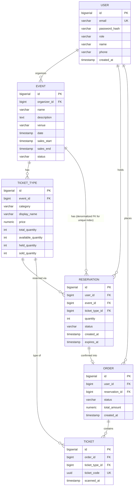

# Entity Model & Validation Strategy — v1 (schema updated by V2 migration)

> Companion doc to the requirements roadmap. Captures decisions made during the system design conversation. Update as later modules (Checkout, Payments, etc.) refine these.

---

## Scope decisions locked in

- **General admission only** (no assigned seat maps) — chosen deliberately because the counter-contention problem (concurrent decrements on an `available` count) is a more direct version of the flash-sale problem than per-seat row locking. Can be revisited/extended later if assigned seating is wanted.
- **Tiered ticket types per event** (e.g. General, VIP, Early Bird) — each tier is its own contested counter.
- **Roles:** `ADMIN`, `ORGANIZER`, `USER`. Organizers create/manage their own events; admins manage everything.
- **Reservation hold duration:** 5 minutes (short on purpose, for easier load testing).
- **Reservation quantity limit:** max 10 tickets per reservation.
- **One active reservation per user per event** at a time (across all ticket types for that event — to be confirmed if this should be per ticket-type instead).

---

## Entities

### User
- `id`
- `email` (unique — also the login identifier)
- `passwordHash`
- `role` — `ADMIN | ORGANIZER | USER`
- `contactInfo` (name, phone — keep minimal for now)
- `createdAt`

### Event
- `id`
- `organizerId` → User (only ORGANIZER/ADMIN can create)
- `name`, `description`, `venue` (just a string for now — no seat map)
- `date`
- `salesStart`, `salesEnd` — defines the valid purchase window
- `status` — e.g. `DRAFT | PUBLISHED | CANCELLED`
- has many `TicketType`

### TicketType
- `id`
- `eventId` → Event
- `category` — fixed enum enforced via DB CHECK: `GENERAL | VIP | EARLY_BIRD | PREMIUM`. Organizers pick a category; adding a new category is a deliberate versioned migration, not a runtime operation (Java enums are compile-time constructs).
- `displayName` — organizer-defined free-text label (e.g., `"Gold Circle Backstage Pass"`, `"Standing Room General"`). Decoupled from `category` so organizers can brand their tiers without being constrained to enum names.
- `price`
- `totalQuantity`
- `availableQuantity`
- `heldQuantity`
- `soldQuantity`
- *(invariant: `available + held + sold = total`, enforced at the DB/transaction level — this is the contested resource for the overselling problem)*

### Reservation
- `id`
- `userId` → User
- `eventId` → Event (**denormalized** — derivable via `ticketTypeId → TicketType → eventId`, but stored directly so PostgreSQL can build the partial unique index without a JOIN. Set once at INSERT, never changes.)
- `ticketTypeId` → TicketType (**v1 scope: exactly one TicketType per Reservation** — see "Deferred: multi-item reservations" below)
- `quantity` (≤ 10, validated via Chain of Responsibility)
- `status` — `HELD | EXPIRED | CONFIRMED | CANCELLED`
- `createdAt`
- `expiresAt` (`createdAt + 5 minutes`)
- *(DB-level guarantee: unique partial index on `(userId, eventId)` WHERE `status = 'HELD'`. Only HELD rows participate — EXPIRED/CONFIRMED/CANCELLED rows fall out of the index, freeing the user to create a new reservation for the same event. This eliminates the check-then-act race: the uniqueness check and the write are one atomic operation at the DB level, which no application-layer check can replicate.)*

### Order
- `id`
- `userId` → User
- `reservationId` → Reservation (the reservation that was confirmed into this order)
- `status` — `PENDING_PAYMENT | PAID | FAILED | CANCELLED`
- `totalAmount`
- `createdAt`
- has many `Ticket` (created at confirmation time, not before)

### Ticket
- `id`
- `orderId` → Order
- `ticketTypeId` → TicketType
- `ticketCode` — UUID, generated server-side at order confirmation, globally unique. The public-facing identifier exposed to users (e.g., as a QR code). UUID avoids exposing sequential IDs.
- `scannedAt` — `TIMESTAMP NULL`. `NULL` = unscanned; a timestamp = validated at entry. Scanning is out of v1 scope but the column is present for future use.
- *(Tickets are the proof-of-purchase artifact — they don't exist until a reservation is successfully confirmed into a paid order. They are NOT the contested resource; the `TicketType` counters are.)*

---

## Relationships summary

- `User` 1 — N `Event` (as organizer)
- `Event` 1 — N `TicketType`
- `Event` 1 — N `Reservation` (direct FK via denormalized `eventId` — added in V2 for the partial unique index)
- `User` 1 — N `Reservation` (a user may hold reservations for many different events, just not two active ones for the *same* event)
- `TicketType` 1 — N `Reservation` (**v1: a Reservation always points to exactly one TicketType** — confirmed via ER diagram)
- `Reservation` 1 — 0..1 `Order` (a Reservation can exist with no Order yet; an Order always points to exactly one Reservation)
- `Order` 1 — N `Ticket`
- `User` 1 — N `Order`
- `TicketType` 1 — N `Ticket`

## Entity Relationship Diagram (current schema)

> Auto-renders in GitHub, GitLab, and most Markdown viewers. Update this diagram whenever a new migration changes the schema.

### Deferred: multi-item reservations (v2 idea, not built now)

We considered making `Reservation ↔ TicketType` many-to-many (so one checkout could combine, e.g., 2 GA + 1 VIP ticket in a single reservation) via a junction entity — tentatively named `ReservationItem` (`reservationId`, `ticketTypeId`, `quantity`). Decided **against** this for v1: it's mostly the same atomic-update skill as the core overselling problem, just applied to multiple rows instead of one, so it doesn't teach a new concept — it adds schema/checkout complexity without a proportional learning payoff. Noted here as a deliberate, scoped-out extension rather than an oversight. If revisited: confirming/expiring a multi-item reservation would need to atomically update *multiple* TicketType counters in one transaction, a strictly harder version of the single-counter case.

---

## Validation layering (Chain of Responsibility vs DB-level guarantee)

The deciding question for which bucket a rule falls into: **does another actor's write, happening between my check and my write, change whether my check is still true?** If yes → needs a DB-level guarantee. If no → a single check is enough, regardless of how much time passes.

| Rule | Bucket | Why |
|---|---|---|
| Reservation quantity ≤ 10 | Chain of Responsibility | Pure input validation, no shared state involved |
| Event sales window (`salesStart` ≤ now ≤ `salesEnd`) | Chain of Responsibility | Not a race — no concurrent actor's write invalidates a time check. (Optional: re-check at commit time for *freshness*, not concurrency correctness) |
| One active reservation per user per event | DB-level (unique partial index) | Classic check-then-act race — two simultaneous requests can both pass the app-level check before either commits |
| Enough tickets available for the requested quantity (overselling prevention) | DB-level (atomic decrement / locking) | Quantitative TOCTOU — concurrent decrements against the same counter |

**Open question carried forward:** exact mechanism for the overselling check — optimistic locking (`@Version`) vs atomic conditional update (`UPDATE ... WHERE available >= :qty`) vs Redis-based hold. To be decided and benchmarked in the Checkout module conversation.

---

## Carried-forward open questions

- ~~Should "one active reservation" be scoped per event, or per ticket-type within an event?~~ **Resolved: per event.** A user can hold active reservations for multiple different events at once, but only one active (HELD) reservation per event at a time.
- ~~Does a Reservation always map to exactly one Order, or could a user combine multiple reservations into one order?~~ **Resolved for v1: one Reservation → one Order, one Reservation → one TicketType.** Multi-ticket-type checkouts deferred to v2 (see "Deferred: multi-item reservations" above).
- ~~Should `eventId` be denormalized directly onto `Reservation`, or always derived via `TicketType`?~~ **Resolved: denormalized.** `eventId` is stored directly on `Reservation` to enable the partial unique index `(userId, eventId) WHERE status='HELD'`. PostgreSQL indexes cannot span JOINs.
- Where exactly does the sales-window re-check at commit time live — in the same transaction as the inventory decrement?

---

## V2 Schema Amendments

> Changes applied via `V2__add_ticket_code_fix_reservation_scope_add_ticket_type_category.sql`.

| Entity | Change | Reason |
|---|---|---|
| `TicketType` | `name` renamed to `display_name` | Disambiguates from `category` — the organizer's free-text label |
| `TicketType` | `category` column added (`GENERAL\|VIP\|EARLY_BIRD\|PREMIUM`) | Fixed enum enforced via CHECK constraint; maps to a Java enum |
| `Reservation` | `event_id` column added (FK → events) | Enables partial unique index without a JOIN |
| `Reservation` | Old index `uq_one_held_reservation_per_user_ticket_type` dropped | Was scoped per ticket type — incorrect |
| `Reservation` | New index `uq_one_held_reservation_per_user_event` on `(user_id, event_id) WHERE status='HELD'` | Correct per-event scope |
| `Ticket` | `ticket_code UUID NOT NULL UNIQUE` added | Public-facing proof-of-purchase identifier (QR code etc.) |
| `Ticket` | `scanned_at TIMESTAMP NULL` added | `NULL` = unscanned; timestamp = entry validated (out of v1 scope, column ready) |
